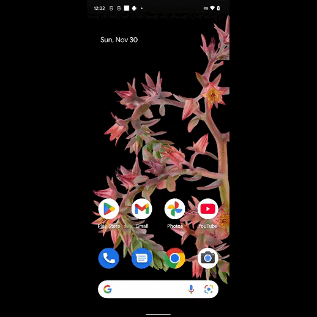
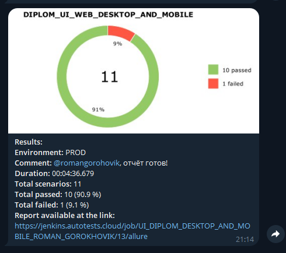

# Дипломный проект тестирования веб-версии онлайн-магазина Askona (Desktop/Mobile)
> [Askona](https://www.askona.ru)


### Список реализованных автотестов:

#### UI-автотесты (Десктопная версия сайта):
* ✅ Переход на главную страницу интернет-магазина "Askona"
* ✅ Проверка результата выдачи глобального поисковика
* ✅ Добавление товара в корзину неавторизованным пользователем
* ✅ Добавление товара в избранное неавторизованным пользователем
* ✅ Подборка подушек из пены-специальной с использованием параметризации

#### Мобильные автотесты для Android (Мобильная версия сайта):
* ✅ Выбор раздела "Новогодние ёлки" через меню-бургер
* ✅ Переход на страницу "О компании" через футер страницы
* ✅ Добавление/удаление новогодней ёлки из корзины

### Используемые технологии
<p  align="center">
   <code></code>
   <code></code>
   <code></code>
   <code></code>
   <code></code>
   <code></code>
   <code></code>
   <code></code>
   <code></code>
   <code></code>
   <code></code>
   <code></code>
   <code></code>
   <code></code>
   <code></code>
</p>

Для написания UI-автотестов сайта "Askona" использовались:  
* `Python v. 3.13`: язык программирования; 
* `Pycharm`: среда разработки (IDE) для языка программирования Python;   
* `Android Studio`: среда разработки (IDE) для запуска и настройки мобильных автотестов;   
* `Selene`: поддерживаемый фреймворк, под капотом используется `Selenium WebDriver`;  
* `Pydantic`: библиотека, с помощью которой реализована конфигурация запуска мобильных автотестов: в Browserstack, на эмуляторе, или на реальном девайсе;
* `PyTest`: библиотека модульного тестирования. В автотестах реализована параметризация;  
* `Appium`: фреймворк для автоматизации тестирования мобильной версии сайта;  
* `Browserstack`: облачная платформа для удаленного запуска мобильных автотестов.  
* `Jenkins`: инструмент CI/CD - с помощью этого инструмента реализован удаленный запуск автотестов, отправка уведомлений в Telegram, интеграция с TMS;  
* `ТестОпс`: TMS-платформа для управления тестированием программного обеспечения. Есть совмещение ручного теста и автотестов в одной системе. Реализована интеграция с Jira;  
* `Jira`: комплексная система управления проектами;  
* `Selenoid`: запускает браузер с тестами в контейнерах Docker (и записывает видео);  
* `Allure Report`: собирает графический отчет о прохождении автотестов;  
* `BotFather`: настраиваемый бот в Telegram - с его помощью результаты прогона автотестов присылаются в Telegram в виде небольшого мини-отчета. 

### Локальный запуск UI автотестов (Desktop/Mobile)

1. Скачать проект и открыть в Pycharm   
2. Создайте следующие файлы:
   * `.env`, `.env.bstack`, `.env.local_emulator`, `.env.local_real` в зависимости от цели, заполните параметры в .env файлах актуальными данными.
   * Пример заполнения параметров указан в файле с расширением `.env.example`
3. Создайте и активируйте виртуальное окружение
   ```bash
   python -m venv .venv
   source .venv/bin/activate
   ```
4. Установите зависимости с помощью pip
   ```bash
   pip install -r requirements.txt
   ```
5. Для локального запуска автотестов необходимо выполнить команду в терминале:
    * Для десктопной версии:<br>
    ```bash
    pytest tests/ui_desktop
    ```
    * Для мобильной версии:<br>
    ```bash
    pytest tests/ui_mobile
    ```
   _Параметр запуска CONTEXT в мобильных автотестах_:  
   ```CONTEXT="bstack" pytest tests/ui_mobile``` - запуск автотестов в облачной платформе Browserstack;  
   ```CONTEXT="local_emulator" pytest tests/ui_mobile``` - запуск автотестов в эмуляторе Android Studio;  
   ```CONTEXT="local_real" pytest tests/ui_mobile``` - запуск автотестов на реальном устройстве.<br>
    * Для запуска всех автотестов выполните команду:<br>
    ```bash
      pytest tests
    ```

6. Выполнить запрос на формирование allure-отчета:
    ```bash
    allure serve allure-results
    ```

<!-- Jenkins -->

###  Запуск проекта в Jenkins
##### В конфигурациях джобы реализованы параметры запуска автотестов с возможностью выбора: только дестоп, только мобильные, или запуск всех автотестов сразу.
### [Задача в jenkins](https://jenkins.autotests.cloud/job/UI_DIPLOM_DESKTOP_AND_MOBILE_ROMAN_GOROKHOVIK/)


<!-- Allure report -->

###  Allure report

##### Результаты выполнения тестов можно посмотреть в Allure-отчете


##### Видео прохождение теста на мобильном устройстве



<!-- Allure TestOps -->

###  Интеграция с Allure TestOps

### [Dashboard](https://allure.autotests.cloud/project/5023/dashboards)


<!-- Jira -->

###  Интеграция с Jira


<!-- Telegram -->

###  Оповещения в Telegram
##### После выполнения тестов в Telegram bot приходит сообщение с графиком и информацией о тестовом прогоне. Реализовано оповещение, только когда тесты падают (условия оповещения настроены в самом Jenkins).

